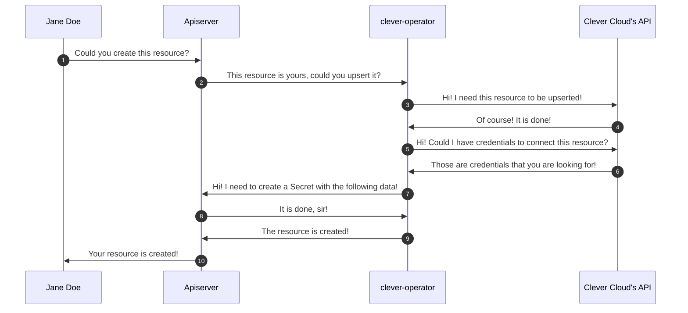

# Concepts

> This document will go through main concepts behind the Clever Cloud operator.

## What are a Kubernetes operator and Custome Resources?

Firstly, if you does not know, what is a Kubernetes operator or Custom
Resources, you should take a look at those resources:

- https://kubernetes.io/docs/concepts/extend-kubernetes/operator/
- https://kubernetes.io/docs/concepts/extend-kubernetes/api-extension/custom-resources/

Besides, there are also great talks about what are they on YouTube, you will
find some links below:

- https://www.youtube.com/watch?v=KBTXBUVNF2I
- https://www.youtube.com/watch?v=lprE0J0kAq0
- https://www.youtube.com/watch?v=_aJ1BdaG2n8

Feel free to create a pull request, if you wanna add some resources to help
people on-board on kubernetes operator and custome resources.

## How it works

At Clever Cloud, we provide a HTTP API to interact with managed services that we
expose. This API is located at [api.clever-cloud.com](https://api.clever-cloud.com).
You could find some documentations following links below:

- https://www.clever-cloud.com/doc/
- https://www.clever-cloud.com/doc/extend/cc-api/
- https://github.com/CleverCloud/clevercloud-sdk-rust

To sum up, the operator will act as an interface between the [Kubernetes'
Apiserver](https://kubernetes.io/docs/concepts/overview/components/#kube-apiserver)
and the Clever Cloud's API. It will treat incoming requests from users like

```yaml
---
apiVersion: api.clever-cloud.com/v1
kind: PostgreSql
metadata:
  namespace: default
  name: postgresql
spec:
  organisation: orga_xxxx
  options:
    version: 13
    encryption: false
  instance:
    region: par
    plan: s_sml
```

into the corresponding managed services at Clever Cloud. We could visualize the
order and lifecycle (as the pattern is run every times that a modification is
performed) with the following schema:



Once, the resource is created you could use the
[Secret](https://kubernetes.io/docs/concepts/configuration/secret/) created by
the operator as a file directly mounted in your
[Pod](https://kubernetes.io/docs/concepts/workloads/pods/) or through environment
variables. You have examples of how to do it through the [examples](../examples/)
folder or following those documentations "[Using Secrets as Environment Variables](https://unofficial-kubernetes.readthedocs.io/en/latest/concepts/configuration/secret/#using-secrets-as-environment-variables)" or "[Using Secrets as Files from a Pod](https://unofficial-kubernetes.readthedocs.io/en/latest/concepts/configuration/secret/#using-secrets-as-files-from-a-pod)".

The Secret created by the operator is __always__ the name of the custom resource
with suffix `-secrets`. So, in the case above, you will find a Secret named
`postgresql-secrets` in the `default` namespace.
